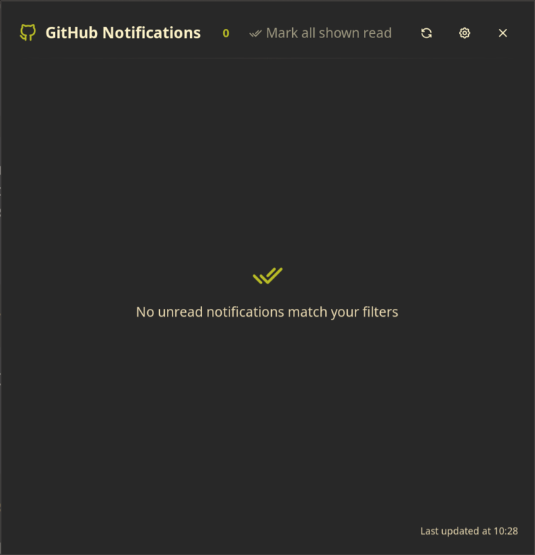

# Noctalia GitHub Notifications

A native Noctalia v5 plugin that puts GitHub notifications in the desktop bar.


## Features

- Unread count and status-aware GitHub icon in the bar
- Filterable GitHub notification reasons
- Notification panel with links to issues and pull requests
- Mark individual notifications or all displayed notifications as read
- Configurable background refresh interval
- Uses existing GitHub CLI authentication; the plugin does not store a token

## Screenshots




## Requirements

- Noctalia v5 with plugin API 24 or newer
- [GitHub CLI](https://cli.github.com/) (`gh`), authenticated with `gh auth login`
- `xdg-open`, normally provided by `xdg-utils`

## Installation

Add this repository as a plugin source and enable the plugin:

```sh
noctalia msg plugins source add github-notifications git https://github.com/tejo/noctalia-github-notifications
noctalia msg plugins enable tejo/github-notifications
```

Then add the **GitHub Notifications** `indicator` widget from Noctalia's bar settings.

## Usage

- Left-click the bar widget to open the notifications panel.
- Right-click the bar widget, or click the cog in its panel, to open settings.
- Click a notification title to open it in your browser.
- Click a check mark to mark one notification as read.
- Click **Mark all shown read** to mark all currently displayed notifications as read.
- Click the refresh button to check immediately.

The outlined GitHub icon means no matching unread notifications exist. It becomes filled and displays the unread count when notifications are present. A red alert icon indicates a fetch error.

## Configuration

The settings page provides checkboxes for every notification reason documented by GitHub, including mentions, review requests, assignments, comments, watched repositories, CI activity, invitations, and security alerts. Mentions and review requests are enabled by default.

The refresh interval defaults to five minutes and can be set between 60 and 3600 seconds.

## IPC

```sh
# Refresh now
noctalia msg plugin tejo/github-notifications:sync all refresh

# Mark all currently displayed notifications as read
noctalia msg plugin tejo/github-notifications:sync all mark-all

# Open or close the panel
noctalia msg panel-toggle tejo/github-notifications:notifications
```

## License

MIT
