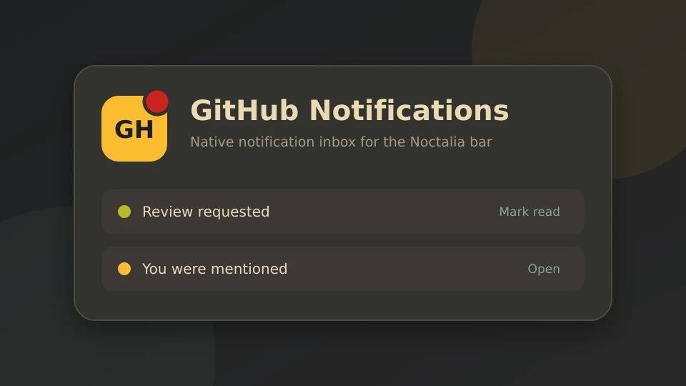
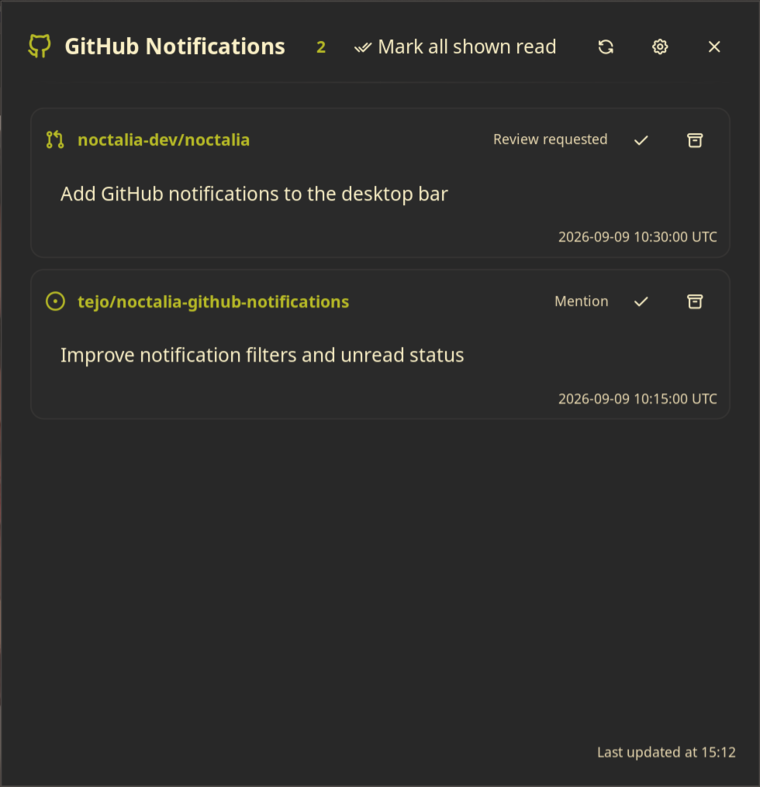
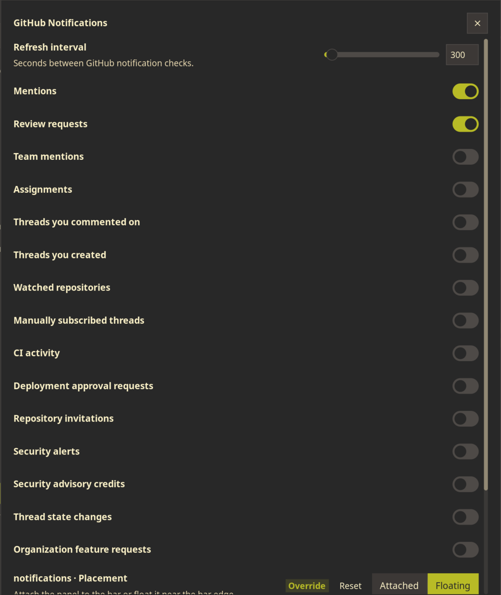

# GitHub Notifications

Show selected unread GitHub notifications in the Noctalia bar, open their issues or pull requests, and mark them as read or Done without opening GitHub's notification inbox.



## Plugin

| Field | Value |
| --- | --- |
| ID | `tejo/github-notifications` |
| Entries | Bar widget: `indicator`; panel: `notifications`; service: `sync` |
| Minimum Noctalia plugin API | `24` |

## Requirements

- `gh`, authenticated with `gh auth login`
- `xdg-open`, normally provided by `xdg-utils`

The plugin uses GitHub CLI authentication and does not read or store a token.

## Usage

1. Enable `tejo/github-notifications` in Noctalia's plugin manager.
2. Add the `indicator` widget from **Settings -> Bar -> Widgets**.
3. Left-click the widget to open the notification panel.
4. Click a title to open the notification in your browser.
5. Click a check mark to mark one notification as read, click the archive button to mark it as Done, or use **Mark all shown read**.

Right-click the bar widget or click the panel's cog button to open plugin settings. The refresh button checks GitHub immediately.

Open the panel without the bar widget using:

```sh
noctalia msg panel-toggle tejo/github-notifications:notifications
```

The outlined GitHub icon indicates that no matching unread notifications exist. It becomes filled, uses the primary accent color, and displays the unread count when notifications are present. An alert icon indicates a fetch error.

## Settings

| Setting | Type | Default | Description |
| --- | --- | --- | --- |
| `refresh_interval` | Integer, 60-3600 seconds | `300` | Time between GitHub notification checks. |
| `show_mention` | Boolean | `true` | Show direct mentions. |
| `show_review_requested` | Boolean | `true` | Show pull-request review requests. |
| Other `show_*` reason filters | Boolean | `false` | Optionally show assignments, comments, subscriptions, CI activity, invitations, security alerts, and other GitHub reasons. |

## Screenshots





## IPC

```sh
# Refresh now
noctalia msg plugin tejo/github-notifications:sync all refresh

# Mark all currently displayed notifications as read
noctalia msg plugin tejo/github-notifications:sync all mark-all
```

## Notes

- The plugin requests unread notifications through `gh api` every five minutes by default.
- Notification links are opened through `xdg-open`.
- Marking a notification as read calls GitHub's notification thread API.
- Marking a notification as Done removes it from the GitHub inbox using the thread API.
- Screenshot notification entries are public demonstration data, not real inbox content.
